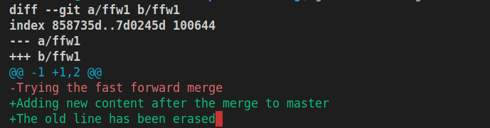
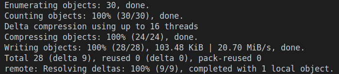
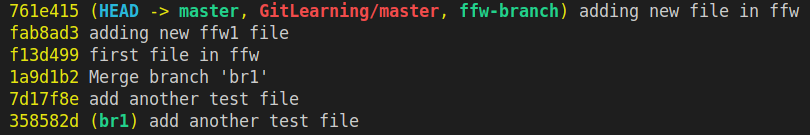
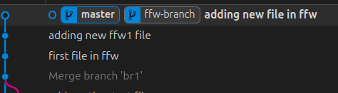
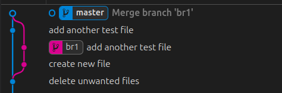
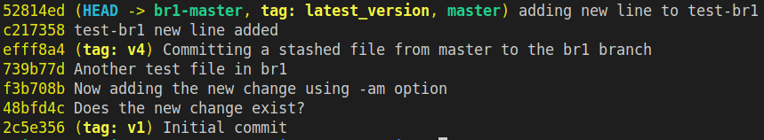
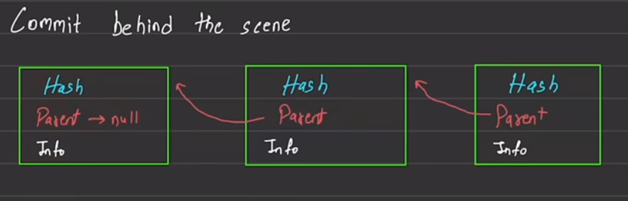

# GIT COMMANDS HANDBOOK
## This Repository contains about git commands and the explanation for each command along with the different flags each command takes

## Initial Setup of Username and Email for the terminal
    > git config --global user.name "user name"
    > git config --global user.email "emailId"
    > git config --global core.editor "code --wait"       waits for window
            
                *** By defualt it uses vim ***

    -Apply the shell command in vscode. This allows Git to know who is code 
            
            *** search ">code" -> Install 'code' command in path ***

    > git config --global init.defaultBranch 'master' (can also be main)

    > git config --global core.autocrlf input   // Use true on Windows

    To Check settings: 
        1. git config --global -e 
        2. In root: .gitconfig File
## To Setup shortcuts for git commands
    git config --global alias.<shortcut> <command>
    Example : alias.st status
## To Store the token auth key, use the git `credential helper`
    git config --global credential.helper store
## Terminology
1. Staging Area/Index
    - Temporary space b/w working directory and the project history
    - The file *to be committed* are put here.
    - This allows to group files going into **next commit(snapshot)**
    - **git ls-files**: Shows the files in Staging Area

## Git commands
### git config  
- Used for setting Options
- FLAGS
    - --system : For all the users in the system
    - --global : For all the repositories of THAT user
    - --local  : For a single repository

### CLONE
- Creates a copy of the Remote *Existing* Repository
- usage: git clone `URL`
- A new folder with the same name as Repo is Created 

### ADD
- Moves files into staging Area
- This makes git to start tracking the file
- Use this command as soon as (part of) work on file is DONE
- Usage: git add *filename1*
- To untrack: git rm --cached *filename1*
- FLAGS
    - **Tracks all files:** --all / -A:

### RESTORE
- to **UNSTAGE** files 
- git restore --staged **filename1** ... 

## git fetch
- Gets the INFO from REMOTE to the LOCAL repo
- **DOESNT UPDATE THE WORKING AREA yet**

### PULL
- Update the local repo with the Remote Repository
- **Brings the changes DIRECTLY to WORKING AREA!**
- helps stay in the latest version of the Repo
- In essence : `PULL = FETCH + MERGE`

### COMMIT
- Save a snapshot of the files **staged**
- Opens the COMMIT_EDITMSG file in the **.git Folder** in the preferred Editor
- FLAGS
    - -m: **Commit message directly as cmd argument**
    - -am: **Add all files and commit them**
        - The *-am* option `cannot be used` on files newly created.  
        - It is used for files added earlier but `further changes made` must be added and committed simultaneously!
        - So for a NEW FILE, first use `git add` ONLY
### STATUS
- Shows the full status of the local directory (working tree information)
- FLAGS
    - -s: **short style status info**
### DIFF
- Shows difference b/w files **Unstaged** and **Last Commit**
- FLAGS
    - --staged/cached: Shows difference b/w files **Staged** and **Last Commit**
    - git diff `branch1..branch2` OR git diff branch1 branch2 (Both produce same results)
    - git diff `commit_id-1..commit_id-2` OR git diff commit_id-1 commit_id-2
- Example of git diff 
- Note that --- and +++ doesnt mean Addition or deletion from file. In git diff, it actually denotes the `Block of code from the respective 
files`
- **For example**:  -Trying the fast forward merge is the block from file a/ffw1
### PUSH
- Push the commited code to the remote Repo
- Requests for Username and PAT (Personal Authentication Token)
- Example snip of a git push

- We can also use SSH keys
- FLAGS
    - -u remote-name local-branch-name : Sets an upstream by linking the remote and local branch. This allows git push to understand where to push in the FUTURE

### LOG
- Shows the previous commited versions of the Repository
- Includes Author,Date, Commit-id
- FLAGS
    - --oneline : Shows a simplified version 

- SUBCOMMAND
    - git log $branch-name : **Shows log of that particular branch**

## git branch
- Shows where the **HEAD** is pointing
- This HEAD can be seen inside .git folder

    ### git branch `branch-name`
    - **Creates** a new timeline from the current Branch

    ### git branch `-d` branch-name 
    - Deletes the specified Branch
- Example branching condition
    - FFW Merge 
    - Not FFW merge
    - **Deletes** the specified Branch

    ### git branch `-M` branch-name
    - **Renames** the current branch name to the specified name

## git checkout `branch-name`
- Moves the HEAD to branch-name mentioned
- Alias to checkout is `switch`
- FLAGS
    - git switch -c new-branch   **Creates the branch and Switches**
    - git checkout -b new-branch   Same as above
    - git checkout $HASH-ID   **Detaches HEAD**. To re-attach use git checkout main
    - git checkout HEAD~2   **Moves two COMMITS `Behind`
- SUBCOMMAND
    - git checkout $hashid   
- ** commit before switching a branch

## git merge
- Three types of Merge exists
    1. Fast forward merge
        - This is where the master does no commit
        - The branch has CHANGES
        - Since the Master Didnt move at all, We fast forward Master to the new HEAD
    2. Not a fast forward
        - The master and branch have done some commits of their own
        - But the commits dont conflict (Not of SAME FILE)
    3. Conflict Merge
## git stash
- Lets say we create a main repo, work and commit some changes
- Now switch to another branch and work such that there is `conflicting changes`
- Now without `committing` (even adding the file won't suffice), we `cannot checkout` to another branch
- 
- During this case, we use **STASH**. This locally saves the changes
- SUBCOMMANDS
    - git stash list          **Lists all shashed worked**
    - git stash:-               **stores the unsaved work**
    - git stash pop:-          **Restores the unsaved work**
    - git stash apply stash@{number}. Example BELOW:

        

- NOTE: git stash pop can be POPPED into `ANY OTHER BRANCH`. From BRANCH-1 I can stash and Pop it into BRANCH-2!!!

## git restore
- Used to restore a file to its previous state

## git rebase
`NEVER RUN THIS FROM THE MAIN BRANCH`
- It is a MERGE command, only that the branch is fully detached and planted to MASTER
- This eliminates unnecessary messages like **Merge branch to master**
- Conflicts occur and must be resolved like in MERGE COMMAND
    - After resolving conflict, must `ADD the file` then do `git rebase --continue`
- MERGES into `SINGLE TIMELINE`
- 

## TAG
- Prints the tags assigned for particular commit-ids
- Useful when versioning the code. Makes it easier to go back to prev versions using a TAG
- TAG is better to use than HASH-ID
- USAGE : 
    - git tag "tag_name" `(DOESN'T ALLOW SPACES)`       **Tags the Current Branch**
    - git tag "tag_name" $HASH-ID
    - git tag "tag_name" HEAD~2
- EXAMPLE  

## CHERRY-PICK
- Similar to MERGE and REBASE
- Rather than merging the ENTIRE COMMIT TIMELINE, picks commits which should MERGE
- USAGE: git cherry-pick $hash-id-1 $hash-id-2 ... `(ORDER MATTERS)`
- Creates new commits on the current branch for the `INCOMING COMMITS`.
- 

## RESET

## GIT WORKING
- Each commit create a **complete snapshot** of the project
    - Uses compression to save space
    - Doesn't allow duplicates
- Note that it doesnt store the **delta change**
- It also stores ID, Author, Date/time, Message

# Case Study
## Modifying a file that is already staged
- When a file is already added (v1), then modified(v2), Git shows it as untracked
- But the prev version added is still tracked
- now if we commit and push, v1 is pushed. v2 is still untracked!
- only in the next commit can we push v2

## Deleting a File
- When doing **rm filename**, This change is not staged
- Thus we need to ADD the file, and commit
- If we want to remove File from **working dir** AND **staging area**
    > **git** rm filenames

## Moving a File
- Like removing a file, use the command
    > **git** mv filenames
- Does the staging of new file and deleting of old file

## Ignoring certain files
- Create a file named **.gitignore**
- File: test.txt
- Directory: dir1/      **remember to use fwd-slash
- Look for gitignore generator. Has templates for different programming languages

## Commit - Behind the scenes

- First Parent points to NULL
- The Child version's Hash is generated using the Parent's information
